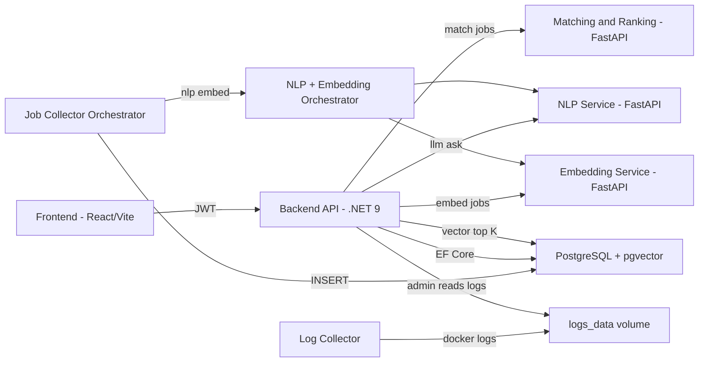

# Job Assistant System

AI-powered job matching + market insights platform (Graduation Project).

## Summary

Job Assistant System is a microservice-based application that **collects job posts**, **normalizes them with an LLM**, **embeds both jobs and user profiles**, and then **recommends the best matches** using a hybrid approach:

1. **Vector similarity search** in PostgreSQL (pgvector) to quickly fetch the most relevant candidates (top-K), and
2. a dedicated **matching & ranking service** for explainable scoring based on experience + skill similarity.

In parallel, the system computes **job-market trends** (top technical skills per role over week/month/3-month windows) to help users understand what to learn next.

## Key technical highlights

- **PostgreSQL + pgvector (1024-d vectors)**: embeddings are stored natively (`vector(1024)`) and queried via cosine distance for similarity retrieval.
- **HNSW vector index (ANN)**: the database is configured with an **HNSW index** for fast vector similarity search on the job-title embedding column.
- **Keyset pagination for vector-ranked results**: the recommended-jobs endpoint supports **cursor pagination** using a composite cursor `(score, id)` (index-friendly alternative to OFFSET/LIMIT).
- **Hybrid ranking pipeline**: fast ANN pre-filtering in DB + a Python ranking microservice for nuanced scoring.
- **Observability**: a trace id (`X-Trace-Id`) is propagated from the .NET API to Python services so logs can be correlated across services. A log-collector container snapshots logs to a shared volume, exposed via an admin endpoint.
- **Security basics**: JWT authentication, password hashing, and admin-only routes.

## Architecture



## Main services (what each one does)

- **Backend/API** (ASP.NET Core + EF Core + Npgsql + pgvector)
  - Auth (register/login), profile management, matched jobs endpoint, trends endpoint, admin endpoints.
  - Performs vector similarity retrieval (`ORDER BY cosine distance`) via pgvector.
- **NLP_service** (FastAPI)
  - Calls an LLM provider (OpenRouter or LM Studio) and returns structured JSON.
- **Embedding_service** (FastAPI)
  - Generates embeddings using `BAAI/bge-large-en-v1.5` (1024 dims).
- **NLP&Embedding_Orchestrator** (FastAPI)
  - Combines normalization (LLM) + embeddings in one call for batch job ingestion.
- **Matching&Ranking_service** (FastAPI)
  - Scores jobs against a profile using weighted category similarity (technologies, job-position skills, experience).
- **Job_collector_orchestrator_service** (Python)
  - Scrapes jobs (e.g., via Apify actors), calls the orchestrator, inserts JobPosts/NormalizedJobPosts/EmbeddedJobPosts, and refreshes Trends.
- **Log_collector_service** (Python)
  - Periodically tails docker logs for key containers and writes them into a shared volume.
- **Frontend** (React + Tailwind)
  - User UI for profile/CV upload, recommended jobs, and trends visualization.

## Database (data model overview)

- `JobPosts` (raw scraped jobs)
- `NormalizedJobPosts` (LLM-refined fields + normalized skills)
- `EmbeddedJobPosts` (pgvector + skill embeddings)
- `Profiles` / `EmbeddedProfiles` (user profile + embeddings)
- `Trends` + `TechnicalSkillsRecorded` (aggregated market insights)

Embeddings are stored using:

- `vector(1024)` for job-title embeddings (pgvector)
- `jsonb` for per-skill embeddings (skill + vector arrays)

## API overview (selected routes)

- Auth
  - `POST /api/accounts/register`
  - `POST /api/accounts/login`
- Profile
  - `POST /api/profile/extract-info/{userId}` (PDF CV → structured profile)
  - `POST /api/profile/{userId}/save` / `PUT /api/profile/{profileId}/update`
  - `GET /api/profile/{profileId}`
- Matching
  - `GET /api/jobs/{profileId}` (recommended jobs, supports cursor pagination)
- Trends
  - `GET /api/trends`
- Admin (JWT role: Admin)
  - `GET /api/admin/job-sources`, `PATCH /api/admin/job-sources/{sourceName}`
  - `GET /api/admin/logs?container=backend|...`
  - `GET/PUT /api/admin/settings`

### Cursor pagination (recommended jobs)

- `GET /api/jobs/{profileId}?cursorScore=<float>&cursorId=<guid>`
  - Omit `cursorScore` and `cursorId` for the first page.
  - Returns `{ jobs: [...], hasNextPage: true, nextCursorScore: 0.84, nextCursorId: "..." }`.
  - Uses **keyset/cursor pagination** over the _vector similarity_ ordering (stable and index-friendly):
    - `score = ROUND((1 - cosine_distance(EmbeddedJobTitle, profileJobTitleVector))::numeric, 2)`
    - Filters low-similarity rows with `score > 0.6`
    - `ORDER BY score DESC, id ASC`
    - Next page predicate: `score < cursorScore OR (score = cursorScore AND id > cursorId)`
  - Note: `cursorScore`/`nextCursorScore` are DB similarity scores (0–1). The `JobPostDTO.Score` field in the response is the ML ranking score (0–100) returned by the matching service.

## Performance notes

### HNSW index (vector similarity)

The system’s database uses an **HNSW (ANN) index** to speed up similarity search over the `EmbeddedJobTitle` vector.

Example (PostgreSQL + pgvector):

```sql
CREATE EXTENSION IF NOT EXISTS vector;

CREATE INDEX IF NOT EXISTS "IX_EmbeddedJobPosts_EmbeddedJobTitle_hnsw"
ON public."EmbeddedJobPosts"
USING hnsw ("EmbeddedJobTitle" vector_cosine_ops);
```

### Cursor pagination (index-friendly retrieval)

Cursor pagination avoids large `OFFSET` scans and is designed to scale as the dataset grows.

## How to run (Docker)

This repo uses Docker Compose for the application services. The database is provided via connection strings (external Postgres, or your own local container).

1. Set environment variables (example names used by `docker-compose.yml`):

- `JobAssistantDbConnectionString` (Npgsql format)
- `psycopg_JobAssistantDbConnectionString` (URL/DSN format)
- `OPENROUTER_API_KEY` (if using OpenRouter)
- `APIFY_API_TOKEN` (for scraping)

2. Start the stack:

```bash
docker compose up --build
```

3. Open:

- Frontend: `http://localhost:5004`
- Backend API: `http://localhost:5000`

## CI/CD

GitHub Actions workflow builds and pushes Docker images using `docker compose build` + `docker compose push`.
